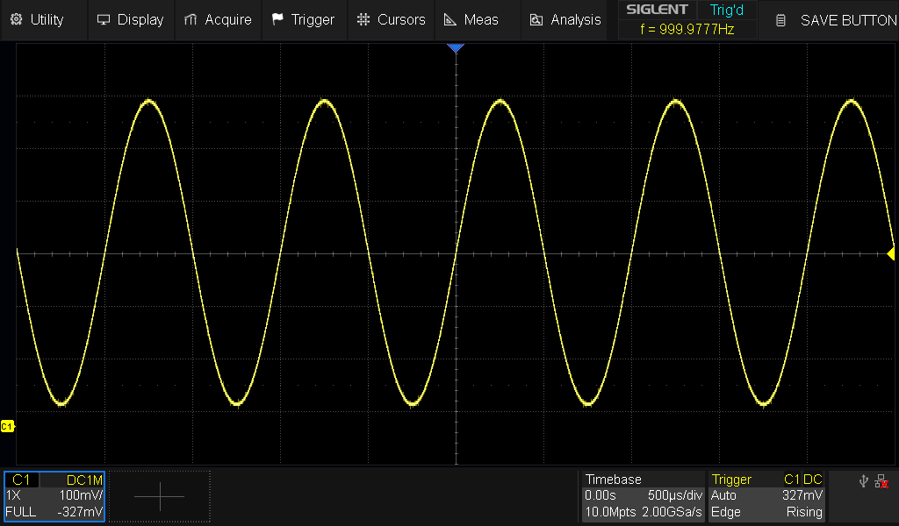
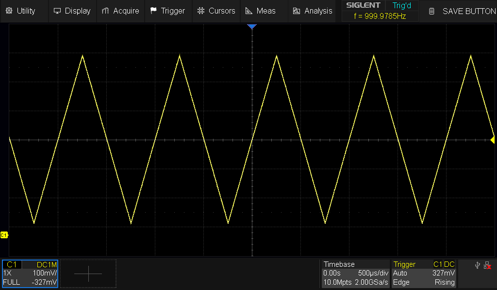
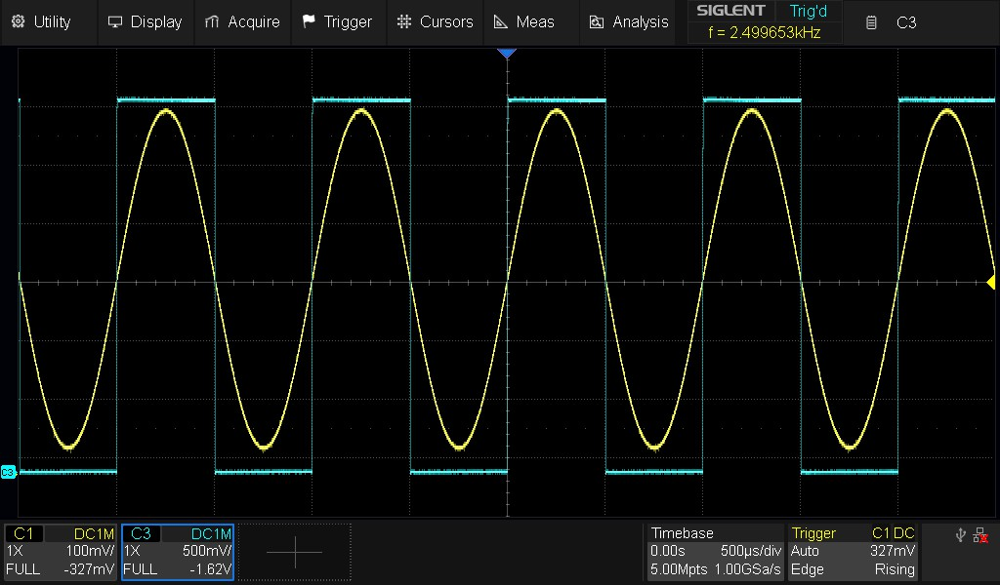

# AD983x DDS Library for STM32 (HAL)

## UPDATED - 2026

A lightweight STM32 HAL driver for the Analog Devices **AD9833** and **AD9834** Direct Digital Synthesis (DDS) waveform generators.

This library allows an STM32 microcontroller to configure and control the DDS chip over SPI. Both hardware SPI and software (bit-banged) SPI are supported. The driver provides control over waveform generation, output frequency, phase settings, and power/sleep modes.

<p align="center">
  
  
  
</p>


---

## Supported Devices

### Microcontrollers
- STM32 microcontrollers using the STM32 HAL library

### DDS Devices
- Analog Devices **AD9833**
- Analog Devices **AD9834**

---

## Features

- Supports AD9833 and AD9834
- Compatible with STM32 HAL
- Hardware SPI or software SPI
- Frequency control using the 28-bit tuning word
- Phase control using the 12-bit phase register
- Frequency register switching for FSK-style operation
- Sine, triangle, and square waveform generation
- Separate digital output control for AD9834 SIGN BIT OUT
- Sleep and DAC power-down modes

---

## Supported Waveforms

| Waveform | AD9833 | AD9834 |
|:--------:|:------:|:------:|
| Sine     | Yes    | Yes    |
| Triangle | Yes    | Yes    |
| Square   | Yes    | Yes    |


---


## Example Usage

### Create and configure the device handle
```c
static AD983x_Handle_t ad9833_dds = {
    .gpioPort                     = GPIOA,                     /* GPIO port used for DDS control pins              */
    .serialDataGpioPin            = GPIO_PIN_7,                /* SDATA: serial data line to the DDS               */
    .serialClockGpioPin           = GPIO_PIN_5,                /* SCLK: serial clock for shifting data             */
    .frameSyncGpioPin             = GPIO_PIN_0,                /* FSYNC: frame sync / chip select for DDS          */
    .spiHandle                    = &hspi1,                    /* Hardware SPI handle (NULL for software SPI)      */
    .masterClockFrequencyHz       = 25000000u,                 /* 25 MHz MCLK input provided to AD9833             */
    .currentWaveformType          = AD983X_WAVE_SINE,          /* Default waveform output (sine wave)              */
    .activeFrequencyRegister      = AD983X_REG_0,              /* Currently selected frequency register (FREQ0)    */
    .activePhaseRegister          = AD983X_REG_0,              /* Currently selected phase register (PHASE0)       */
    .sleep1BitState               = AD983X_SLEEP_DISABLED,     /* DAC sleep control bit state                      */
    .sleep12BitState              = AD983X_SLEEP_DISABLED,     /* Master clock / internal sleep control            */
    .deviceType                   = AD983X_DEVICE_AD9833,      /* Specifies the DDS device type                    */
    .frequencyHz                  = { 0u, 0u },                /* Stored frequencies for FREQ0 and FREQ1 registers */
    .phaseDeg                     = { 0u, 0u },                /* Stored phases for PHASE0 and PHASE1 registers    */
};
```

### Initialization

```c
AD983x_Init(&dds, AD983X_WAVE_SINE, 1000, 0);
```

### Change frequency

```c
AD983x_SetFrequencyHz(&dds, AD983X_REG_0, 10000);
```

### Change waveform

```c
AD983x_SetWaveform(&dds, AD983X_WAVE_TRIANGLE);
```

### Enable digital square output on AD9834

```c
AD9834_SetSquareWaveMode(&dds, AD9834_SQUARE_MSB);
```
### Power Modes

```c
AD983x_Wake(&dds);
AD983x_Sleep(&dds);
AD983x_DeepSleep(&dds);
AD983x_DacOff(&dds);
```
---

## Hardware Requirements

- Stable **MCLK** source
- SPI connection
- Proper analog output filtering
- Correct reference resistor network

Refer to the official Analog Devices datasheets for recommended hardware connections.

## Examples

Complete example projects are provided in the **examples** folder. The examples are configured for **STM32CubeIDE** and target the **STM32G431KBT6** microcontroller

---

## Datasheets
[Analog Devices AD9833 Datasheet](https://www.analog.com/media/en/technical-documentation/data-sheets/ad9833.pdf)

[Analog Devices AD9834 Datasheet](https://www.analog.com/media/en/technical-documentation/data-sheets/ad9834.pdf)

---

## License

MIT License
